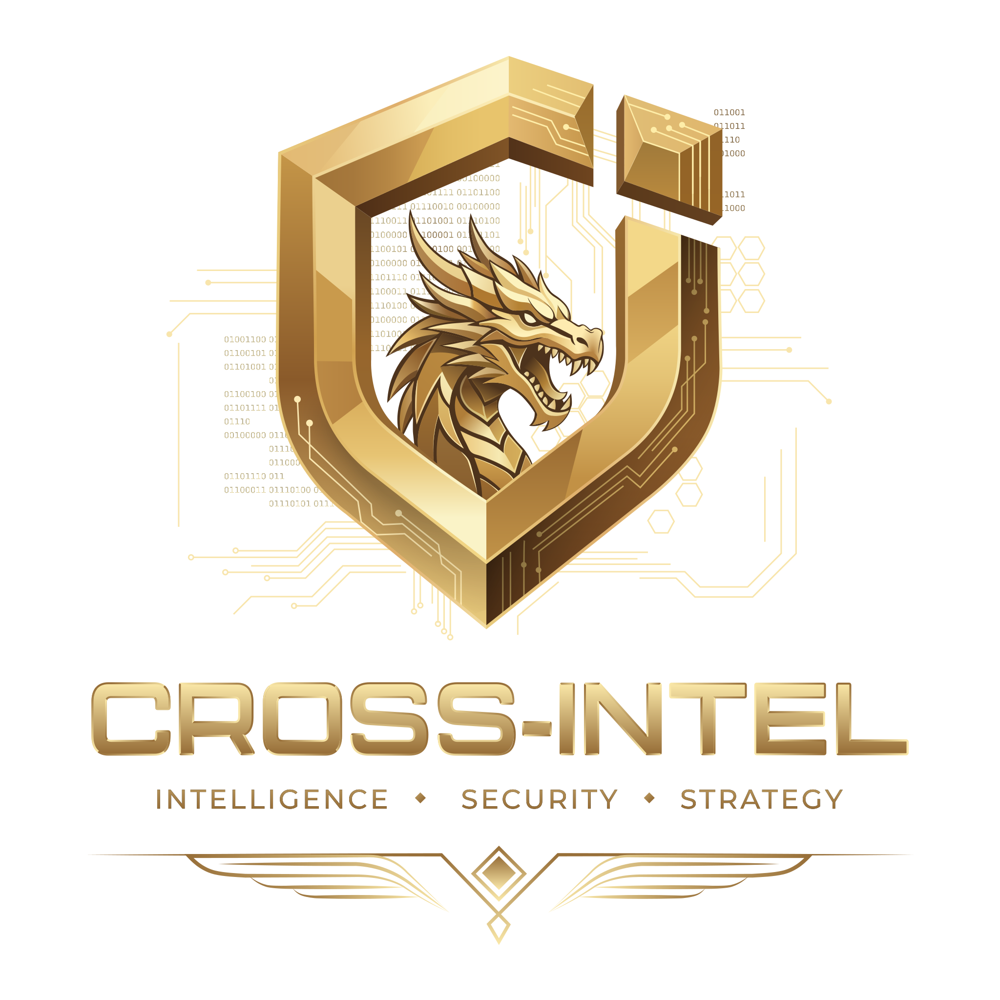

# CROSS-INTEL

### Cybersecurity as a Service — end to end.

**Offensive DNA · Adversarial Validation · Defensive Operations**

 

---

## Who We Are

CROSS-INTEL is a **cybersecurity-first company** with DNA rooted in offensive security, adversarial validation, and defensive operations.

We deliver **Cybersecurity as a Service, end to end**: whatever you need to stay ahead of adversaries, we design, operate, and validate it — from continuous adversary emulation and SOC operations to penetration testing, threat intelligence, and vCISO leadership.

Our engineers, researchers, and operators live cybersecurity every day. This is our craft, our identity, and the reason global organizations trust us to protect what matters.

---

## Key Pillars

| 🧬 Cybersecurity DNA | 🛡️ Cybersecurity as a Service | 🌍 Global Presence |
|:---|:---|:---|
| Offensive, defensive, and adversarial expertise in one team. | End-to-end coverage under a single, unified portfolio. | Europe · LATAM · Brazil · United States · Middle East |

> **Detect, validate, remediate** — one unified portfolio to protect and scale your business across EU, LATAM, US, and the Middle East.

---

## 🛡️ Managed Security Services

*Operational security delivered end to end by CROSS-INTEL Labs — from continuous monitoring to offensive testing and security leadership.*

### 🎯 Continuous Adversary Emulation
Expert-managed continuous validation of your defenses against real-world TTPs.
- MITRE ATT&CK aligned scenario design
- SOC detection and response validation
- CTI enrichment from real adversary behavior
- Quarterly threat profile, monthly campaigns

> *Always-on program, not a point-in-time red team engagement.*
[→ Learn more](https://cross-intel.com/services/continuous-adversary-emulation)

### 🌐 SOC as a Service
24/7 threat detection, response, and hunting across EU, LATAM, and US.
- Multi-region SOC operating 24/7/365
- MITRE ATT&CK aligned detection engineering
- Threat hunting and incident response on demand
- SIEM, EDR, XDR, and cloud telemetry ingestion

> *Follow-the-sun coverage from three regions, not a single offshore team.*
[→ Learn more](https://cross-intel.com/services/soc-as-a-service)

### 💥 Penetration Testing
Adversary-grade testing of apps, networks, APIs, and cloud by certified offensive engineers.
- Web, mobile, API, network, and cloud scope
- PTES and OWASP aligned methodology
- Manual exploitation, not just automated scans
- Executive and technical reports with retest included

> *Senior team holding OSCP, OSCE, CRTO, and CISSP certifications.*
[→ Learn more](https://cross-intel.com/services/penetration-testing)

### 🔎 Vulnerability Scanning
Continuous, risk-prioritized vulnerability discovery, integrated with Drogonsec.
- Authenticated and unauthenticated scans
- CVSS scoring enriched with business context
- Native integration with Drogonsec open source tooling
- Trend dashboards and SLA-based remediation tracking

> *Risk-based prioritization tied to real exploitability, not raw CVE counts.*
[→ Learn more](https://cross-intel.com/services/vulnerability-scanning)

### 🧠 Threat Intelligence
Actionable CTI tailored to your sector, geography, and crown-jewel assets.
- Strategic, operational, and tactical CTI feeds
- Brand, executive, and dark web monitoring
- IOC and TTP enrichment integrated to your SIEM and EDR
- Weekly briefings plus on-demand threat advisories

> *Intelligence produced by analysts, not just aggregated open source feeds.*
[→ Learn more](https://cross-intel.com/services/threat-intelligence)

### 🎖️ vCISO as a Service
Senior security leadership on demand to build, run, and govern your program.
- Security strategy, roadmap, and budget ownership
- ISO 27001, SOC 2, NIS2, and LGPD readiness
- Board, audit, and customer security responses
- Vendor risk, M&A due diligence, and incident leadership

> *CISSP-level operators backed by the full CROSS-INTEL offensive and SOC teams.*
[→ Learn more](https://cross-intel.com/services/vciso)

---

## 🚀 Strategic Services

*Partnerships, global market operations, and product strategy for vendors and scale-ups going to market in EU, LATAM, US, and the Middle East.*

### 🤝 Technology Reseller & Alliances
Authorized **Segura® PAM** partner. Licensing, implementation, and 24x7 sustainment.
- Certified Segura® reseller and integrator
- PAM architecture, deployment, and integration
- Sustainment, health checks, and 24x7 incident support
- Audit and compliance evidence packages

> *End-to-end Segura® lifecycle across LATAM, Brazil, Europe, and Middle East.*
[→ Learn more](https://cross-intel.com/services/technology-reseller)

### 🧩 Product Development Strategy
From MVP validation to product acceleration for cybersecurity and tech firms.
- MVP scoping, validation, and roadmap design
- Open source project design and engineering
- Security engineering for SaaS and platforms
- Go-to-market and product positioning support

> *Founder-friendly model that turns vision into shippable, scalable products.*
[→ Talk to us](https://cross-intel.com/services)

### 📈 Global Market Operations · GTM
Commercial arm for expansion into EU, LATAM, US, and the Middle East.
- Sales Operations and Sales Engineering
- Head of Sales and Sales Advisor
- Channel Development and alliances
- Marketing and Demand Generation

> *Operators, not advisors. Outcome-based models including revenue share.*
[→ Learn more](https://cross-intel.com/services/global-market-operations)

---

## 🌍 Global Presence

**🇪🇺 Europe** · **🌎 LATAM** · **🇧🇷 Brazil** · **🇺🇸 United States** · **🕌 Middle East**

---

### Stay ahead of adversaries.

Whatever you need to defend and scale, **we design, operate, and validate it.**

 

*© CROSS-INTEL — Cybersecurity as a Service*

